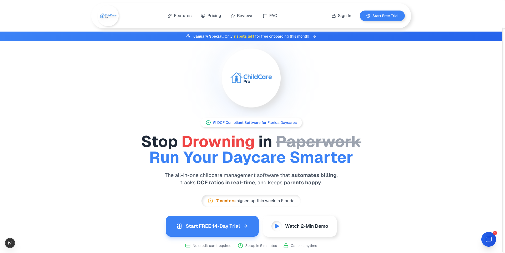
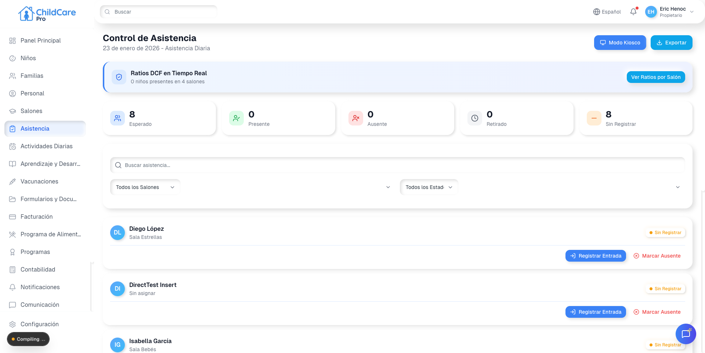
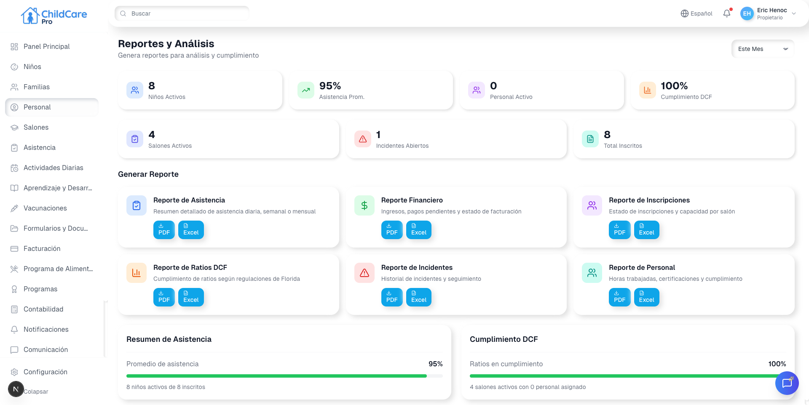

# ChildCare Pro - Manual de Usuario Completo

## Guía Completa del Sistema de Gestión de Guarderías

---

# Tabla de Contenidos

1. [Introducción](#1-introducción)
2. [Primeros Pasos](#2-primeros-pasos)
3. [Panel Principal (Dashboard)](#3-panel-principal-dashboard)
4. [Gestión de Niños](#4-gestión-de-niños)
5. [Gestión de Familias](#5-gestión-de-familias)
6. [Control de Asistencia](#6-control-de-asistencia)
7. [Gestión del Personal](#7-gestión-del-personal)
8. [Administración de Salones](#8-administración-de-salones)
9. [Facturación y Pagos](#9-facturación-y-pagos)
10. [Programa de Alimentos (CACFP)](#10-programa-de-alimentos-cacfp)
11. [Actividades Diarias](#11-actividades-diarias)
12. [Hitos de Aprendizaje](#12-hitos-de-aprendizaje)
13. [Documentos y Formularios](#13-documentos-y-formularios)
14. [Inmunizaciones](#14-inmunizaciones)
15. [Registro de Incidentes](#15-registro-de-incidentes)
16. [Comunicación](#16-comunicación)
17. [Notificaciones](#17-notificaciones)
18. [Reportes del Sistema](#18-reportes-del-sistema)
19. [Programas Especiales (VPK/School Readiness)](#19-programas-especiales)
20. [Contabilidad](#20-contabilidad)
21. [Admisiones](#21-admisiones)
22. [Configuración del Sistema](#22-configuración-del-sistema)
23. [Panel de Administrador](#23-panel-de-administrador)
24. [Preguntas Frecuentes](#24-preguntas-frecuentes)

---

# 1. Introducción

## ¿Qué es ChildCare Pro?

**ChildCare Pro** es una plataforma completa de gestión para guarderías y centros de cuidado infantil. Diseñada especialmente para cumplir con las regulaciones del DCF (Department of Children and Families) de Florida, esta herramienta le permite administrar todos los aspectos de su centro desde un solo lugar.


*Figura 1.1: Página principal de ChildCare Pro*

### Características Principales:

| Característica | Descripción |
|----------------|-------------|
| **Multi-idioma** | Disponible en Español e Inglés |
| **Modo Oscuro** | Interfaz adaptable para reducir fatiga visual |
| **Responsive** | Funciona en computadoras, tablets y celulares |
| **Cumplimiento DCF** | Ratios y reportes según normativas de Florida |
| **Pagos Integrados** | Procesamiento de tarjetas con Stripe |
| **Reportes Automáticos** | Exportación a PDF y Excel |

### Beneficios para su Centro:

- **Ahorro de Tiempo**: Automatice tareas administrativas repetitivas
- **Mejor Comunicación**: Mantenga informadas a las familias en tiempo real
- **Cumplimiento Legal**: Asegure el cumplimiento de ratios DCF
- **Control Financiero**: Seguimiento preciso de pagos y facturación
- **Desarrollo Infantil**: Documente el progreso de cada niño

---

# 2. Primeros Pasos

## 2.1 Acceso al Sistema

### Iniciar Sesión


*Figura 2.1: Pantalla de inicio de sesión de ChildCare Pro*

1. Abra su navegador web (Chrome, Firefox, Safari o Edge)
2. Ingrese la dirección de su centro: `https://sucentro.childcarepro.com`
3. En la pantalla de inicio de sesión, ingrese:
   - **Correo electrónico**: Su email registrado
   - **Contraseña**: Su contraseña segura
4. Haga clic en **"Iniciar Sesión"**

### Opciones de Inicio de Sesión

- **Con Google**: Haga clic en "Continuar con Google" para usar su cuenta de Google
- **Con Email**: Ingrese sus credenciales manualmente

### ¿Olvidó su Contraseña?

1. En la pantalla de inicio, haga clic en **"¿Olvidó su contraseña?"**
2. Ingrese su correo electrónico
3. Haga clic en **"Enviar enlace de recuperación"**
4. Revise su bandeja de entrada (y carpeta de spam)
5. Haga clic en el enlace recibido
6. Cree una nueva contraseña segura

### Requisitos de Contraseña:
- Mínimo 8 caracteres
- Al menos una letra mayúscula
- Al menos un número
- Al menos un carácter especial (!@#$%^&*)

## 2.2 Navegación del Sistema

### Menú Lateral (Sidebar)

El menú lateral se encuentra en el lado izquierdo de la pantalla y contiene todas las secciones del sistema:

| Icono | Sección | Función |
|-------|---------|---------|
| 🏠 | Dashboard | Panel principal con resumen |
| 👶 | Niños | Gestión de niños matriculados |
| 👨‍👩‍👧 | Familias | Gestión de familias y tutores |
| ✓ | Asistencia | Control de entrada y salida |
| 👥 | Personal | Administración del staff |
| 🏫 | Salones | Gestión de aulas |
| 💰 | Facturación | Pagos y facturas |
| 🍽️ | Alimentos | Programa CACFP |
| 📋 | Actividades | Registro diario |
| ⭐ | Aprendizaje | Hitos de desarrollo |
| 📄 | Documentos | Archivos y formularios |
| 💉 | Inmunizaciones | Control de vacunas |
| ⚠️ | Incidentes | Reportes de incidentes |
| 💬 | Comunicación | Mensajes con familias |
| 🔔 | Notificaciones | Alertas del sistema |
| 📊 | Reportes | Generación de informes |
| ⚙️ | Configuración | Ajustes del sistema |

### Barra Superior

- **Logo**: Haga clic para volver al Dashboard
- **Selector de Idioma**: Cambie entre Español e Inglés
- **Modo Oscuro/Claro**: Ajuste la apariencia visual
- **Perfil de Usuario**: Acceda a su cuenta y cierre sesión

---

# 3. Panel Principal (Dashboard)

## 3.1 Vista General

El Dashboard es su centro de comando. Al iniciar sesión, verá un resumen completo del estado actual de su centro.


*Figura 3.1: Panel principal (Dashboard) de ChildCare Pro*

### Secciones del Dashboard:

#### Tarjetas de Estadísticas Rápidas

En la parte superior encontrará 4 tarjetas con información clave:

| Tarjeta | Información |
|---------|-------------|
| **Niños Activos** | Total de niños matriculados actualmente |
| **Asistencia Hoy** | Niños presentes / Total esperado |
| **Personal en Servicio** | Staff trabajando actualmente |
| **Ingresos del Mes** | Total facturado este mes |

#### Monitor de Ratios DCF

Esta sección muestra en tiempo real si su centro cumple con los ratios requeridos por el DCF de Florida:

| Grupo de Edad | Ratio Requerido | Máximo por Grupo |
|---------------|-----------------|------------------|
| Infantes (0-12 meses) | 4 niños : 1 adulto | 8 niños |
| 1 año | 6 niños : 1 adulto | 12 niños |
| 2 años | 11 niños : 1 adulto | 22 niños |
| 3 años | 15 niños : 1 adulto | 30 niños |
| 4-5 años | 20 niños : 1 adulto | 40 niños |
| 5+ años (Escolar) | 25 niños : 1 adulto | 50 niños |

**Indicadores de Color:**
- 🟢 **Verde**: Ratio dentro del límite
- 🟡 **Amarillo**: Cerca del límite (precaución)
- 🔴 **Rojo**: Excede el ratio permitido (acción requerida)

#### Resumen de Asistencia

Gráfico visual que muestra:
- **Presentes**: Niños que han llegado hoy
- **Ausentes**: Niños que no asistieron
- **Tardanzas**: Llegadas después del horario

#### Acciones Rápidas

Botones de acceso rápido a funciones frecuentes:
- ➕ **Registrar Check-in**: Marcar llegada de un niño
- 📝 **Nueva Actividad**: Registrar una actividad
- 💰 **Nueva Factura**: Crear factura rápida
- 📋 **Ver Reportes**: Acceder a reportes

## 3.2 Cómo Usar el Dashboard

### Actualizar Datos

Los datos del Dashboard se actualizan automáticamente cada 30 segundos. Para forzar una actualización:
1. Haga clic en el botón **"Actualizar"** (🔄) en la esquina superior derecha
2. O presione la tecla **F5** en su teclado

### Personalizar Vista

Puede ajustar qué información ver:
1. Haga clic en **⚙️ Configuración del Dashboard**
2. Active o desactive las secciones deseadas
3. Arrastre las tarjetas para reorganizarlas
4. Haga clic en **"Guardar"**

---

# 4. Gestión de Niños

## 4.1 Vista General

La sección de **Niños** le permite administrar toda la información de los menores matriculados en su centro.


*Figura 4.1: Pantalla de gestión de niños*

**Ruta de acceso:** Menú lateral → **Niños**

### Información que puede gestionar:

- Datos personales del niño
- Información médica y alergias
- Contactos de emergencia
- Personas autorizadas para recoger
- Salón asignado
- Horario de asistencia
- Documentos requeridos
- Historial de asistencia
- Progreso de desarrollo

## 4.2 Listado de Niños

### Vista de Lista

Al acceder a la sección, verá una tabla con todos los niños matriculados:

| Columna | Descripción |
|---------|-------------|
| **Foto** | Avatar o foto del niño |
| **Nombre** | Nombre completo |
| **Edad** | Edad calculada automáticamente |
| **Salón** | Aula asignada |
| **Estado** | Activo, Inactivo, Graduado |
| **Acciones** | Ver, Editar, Eliminar |

### Filtros y Búsqueda

**Búsqueda rápida:**
1. Escriba el nombre del niño en el campo de búsqueda
2. Los resultados se filtran automáticamente

**Filtros avanzados:**
- **Por Salón**: Seleccione un salón específico
- **Por Estado**: Activo, Inactivo, Todos
- **Por Edad**: Rango de edades
- **Por Programa**: VPK, School Readiness, Regular

## 4.3 Registrar un Nuevo Niño

### Paso a Paso:

1. Haga clic en el botón **"+ Nuevo Niño"** (esquina superior derecha)

2. **Información Personal:**
   - Nombre completo
   - Fecha de nacimiento
   - Género
   - Foto (opcional)

3. **Información de Contacto:**
   - Dirección del hogar
   - Teléfono principal
   - Email de contacto

4. **Información Médica:**
   - Médico de cabecera
   - Teléfono del médico
   - Alergias conocidas
   - Condiciones médicas
   - Medicamentos actuales
   - Dieta especial

5. **Asignación:**
   - Seleccione el salón
   - Horario de asistencia (tiempo completo/parcial)
   - Fecha de inicio

6. **Familia:**
   - Seleccione o cree la familia asociada
   - Tutores legales
   - Contactos de emergencia

7. Revise la información y haga clic en **"Guardar"**

### Campos Obligatorios:
- Nombre y apellido
- Fecha de nacimiento
- Al menos un tutor legal
- Al menos un contacto de emergencia

## 4.4 Perfil del Niño

### Acceder al Perfil:

1. En la lista de niños, haga clic en el **nombre** del niño
2. O haga clic en el ícono de **ojo** (👁️) en la columna de acciones

### Secciones del Perfil:

#### Información General
- Datos personales completos
- Foto del niño
- Edad y fecha de nacimiento
- Estado de matrícula

#### Información Médica
- Alergias (con alertas visuales)
- Condiciones de salud
- Medicamentos
- Instrucciones especiales

#### Familia y Contactos
- Tutores legales
- Contactos de emergencia
- Personas autorizadas para recoger

#### Documentos
- Lista de documentos requeridos
- Estado de cada documento (✓ Completo, ⚠️ Pendiente, ❌ Vencido)
- Opción para subir archivos

#### Historial
- Registro de asistencia
- Incidentes reportados
- Pagos realizados

#### Desarrollo
- Hitos de aprendizaje alcanzados
- Evaluaciones
- Notas del maestro

## 4.5 Editar Información de un Niño

1. Acceda al perfil del niño
2. Haga clic en **"Editar"** (ícono de lápiz ✏️)
3. Modifique los campos necesarios
4. Haga clic en **"Guardar Cambios"**

**Nota:** Algunos cambios (como el salón asignado) pueden requerir aprobación del administrador.

## 4.6 Dar de Baja a un Niño

Cuando un niño deja el centro:

1. Acceda al perfil del niño
2. Haga clic en **"Opciones"** → **"Dar de Baja"**
3. Seleccione el motivo:
   - Graduación
   - Cambio de centro
   - Mudanza
   - Otro
4. Ingrese la fecha efectiva
5. Agregue notas (opcional)
6. Confirme la acción

**Importante:** Dar de baja NO elimina el historial. El registro se mantiene para reportes.

---

# 5. Gestión de Familias

## 5.1 Vista General

La sección de **Familias** le permite administrar los grupos familiares, tutores legales y contactos autorizados.


*Figura 5.1: Pantalla de gestión de familias*

**Ruta de acceso:** Menú lateral → **Familias**

### ¿Por qué gestionar familias?

- Un niño puede tener múltiples tutores (padres divorciados)
- Hermanos comparten la misma familia (facturación conjunta)
- Múltiples contactos de emergencia por familia
- Personas autorizadas para recoger niños

## 5.2 Listado de Familias

### Vista de Lista

| Columna | Descripción |
|---------|-------------|
| **Nombre Familiar** | Apellido o nombre de la familia |
| **Tutores** | Nombres de los padres/tutores |
| **Niños** | Cantidad de niños matriculados |
| **Balance** | Saldo pendiente de pago |
| **Estado** | Activa, Inactiva |

### Búsqueda y Filtros

- **Buscar**: Por nombre de familia o tutor
- **Filtrar por Estado**: Activas, Inactivas, Todas
- **Filtrar por Balance**: Con saldo, Sin saldo

## 5.3 Crear una Nueva Familia

### Paso a Paso:

1. Haga clic en **"+ Nueva Familia"**

2. **Información de la Familia:**
   - Nombre de la familia (ej: "Familia García")
   - Dirección principal
   - Idioma preferido

3. **Tutor Principal:**
   - Nombre completo
   - Relación con el niño (Madre, Padre, Tutor Legal)
   - Teléfono
   - Email
   - Dirección (si es diferente)
   - Lugar de trabajo

4. **Segundo Tutor (opcional):**
   - Mismos campos que el tutor principal

5. **Contactos de Emergencia:**
   - Nombre
   - Relación
   - Teléfono
   - Orden de contacto (1°, 2°, 3°)

6. **Personas Autorizadas para Recoger:**
   - Nombre
   - Relación
   - Teléfono
   - Foto de identificación (opcional)

7. Haga clic en **"Guardar Familia"**

## 5.4 Perfil de Familia

### Acceder al Perfil:

Haga clic en el nombre de la familia en la lista.

### Secciones Disponibles:

#### Información General
- Datos de contacto
- Dirección
- Preferencias de comunicación

#### Tutores y Guardianes
- Lista de todos los tutores
- Información de contacto de cada uno
- Permisos de cada tutor

#### Niños Asociados
- Todos los niños de esta familia
- Estado de cada niño
- Acceso rápido a perfiles

#### Contactos de Emergencia
- Lista ordenada por prioridad
- Información de contacto
- Disponibilidad

#### Personas Autorizadas
- Lista de personas que pueden recoger
- Foto de identificación
- Restricciones especiales

#### Historial de Facturación
- Todas las facturas emitidas
- Pagos realizados
- Balance actual

## 5.5 Agregar Contactos Autorizados

Los contactos autorizados son personas (además de los tutores) que pueden recoger a los niños.

### Agregar un Contacto:

1. Acceda al perfil de la familia
2. Vaya a la pestaña **"Contactos Autorizados"**
3. Haga clic en **"+ Agregar Persona"**
4. Complete la información:
   - Nombre completo
   - Relación (Abuela, Tía, Niñera, etc.)
   - Teléfono de contacto
   - Suba una foto de identificación
   - Notas especiales
5. Haga clic en **"Guardar"**

### Restricciones Especiales:

Si hay personas que NO pueden recoger al niño (por orden judicial, etc.):

1. Marque la casilla **"Restricción"**
2. Agregue el nombre de la persona
3. Suba documentación legal si está disponible
4. Esta persona aparecerá en alerta roja

---

# 6. Control de Asistencia

## 6.1 Vista General

El módulo de **Asistencia** le permite registrar las entradas y salidas de los niños de forma precisa.


*Figura 6.1: Pantalla de control de asistencia*

**Ruta de acceso:** Menú lateral → **Asistencia**

### Funcionalidades Principales:

- Check-in (registro de llegada)
- Check-out (registro de salida)
- Modo Kiosco para padres
- Historial de asistencia
- Reportes de puntualidad

## 6.2 Registro Manual de Asistencia

### Marcar Llegada (Check-in):

1. Acceda a **Asistencia** desde el menú
2. Busque al niño por nombre o salón
3. Haga clic en el botón verde **"Check-in"**
4. El sistema registra:
   - Hora exacta de llegada
   - Persona que hizo el registro
   - Si llegó a tiempo o tarde

### Marcar Salida (Check-out):

1. Busque al niño que está presente (indicador verde)
2. Haga clic en el botón rojo **"Check-out"**
3. Seleccione quién recoge al niño:
   - Tutor (lista desplegable)
   - Persona autorizada
4. Confirme la identidad
5. El sistema registra la hora de salida

### Indicadores de Estado:

| Color | Estado | Significado |
|-------|--------|-------------|
| 🟢 Verde | Presente | El niño está en el centro |
| 🔴 Rojo | Ausente | No ha llegado |
| 🟡 Amarillo | Tardanza | Llegó después del horario |
| 🔵 Azul | Salida temprana | Salió antes del horario |

## 6.3 Modo Kiosco

El Modo Kiosco está diseñado para que los padres registren la asistencia por sí mismos usando una tablet en la entrada del centro.

**Ruta:** Menú → **Asistencia** → **Modo Kiosco**

### Configurar el Kiosco:

1. Use una tablet dedicada
2. Acceda a `/dashboard/attendance/kiosk`
3. Active el modo pantalla completa (F11)
4. El kiosco queda listo para usar

### Proceso para Padres:

1. **Seleccionar Niño:**
   - Busque por nombre o foto
   - Toque el nombre del niño

2. **Verificar Identidad:**
   - Ingrese código PIN (4 dígitos)
   - O escanee código QR del padre

3. **Confirmar Acción:**
   - Check-in: Confirme la llegada
   - Check-out: Seleccione quién recoge

4. **Firma Digital:**
   - Firme en la pantalla con el dedo
   - Confirme la firma

5. **Confirmación:**
   - Se muestra mensaje de éxito
   - El padre puede ver la hora registrada

### Configurar PIN de Padres:

1. Acceda al perfil de la familia
2. Vaya a **"Configuración de Acceso"**
3. Genere o asigne un PIN de 4 dígitos
4. El PIN se envía automáticamente por email

## 6.4 Historial de Asistencia

### Ver Historial:

1. En la sección de Asistencia, haga clic en **"Historial"**
2. Seleccione el rango de fechas
3. Filtre por:
   - Niño específico
   - Salón
   - Estado (Presentes, Ausentes, Tardanzas)

### Información del Historial:

| Campo | Descripción |
|-------|-------------|
| Fecha | Día del registro |
| Niño | Nombre del niño |
| Check-in | Hora de llegada |
| Check-out | Hora de salida |
| Horas Totales | Tiempo en el centro |
| Registrado por | Quién hizo el registro |
| Recogido por | Quién recogió al niño |

### Exportar Historial:

1. Configure los filtros deseados
2. Haga clic en **"Exportar"**
3. Seleccione el formato:
   - **Excel**: Para análisis detallado
   - **PDF**: Para impresión
   - **CSV**: Para otros sistemas

## 6.5 Reportes de Asistencia

### Reporte Diario:

Muestra la asistencia de un día específico:
- Total de niños esperados
- Niños presentes
- Niños ausentes
- Tardanzas

### Reporte Semanal/Mensual:

Análisis de tendencias:
- Promedio de asistencia
- Días con más ausencias
- Niños con más tardanzas
- Gráficos de tendencia

### Reporte por Niño:

Historial individual:
- Porcentaje de asistencia
- Patrones de tardanza
- Horas promedio en el centro

---

# 7. Gestión del Personal

## 7.1 Vista General

La sección de **Personal** le permite administrar a todos los empleados de su centro: maestros, asistentes, personal administrativo, limpieza, cocina, etc.

**Ruta de acceso:** Menú lateral → **Personal**

### Funcionalidades:

- Registro de empleados
- Control de certificaciones
- Asignación a salones
- Control de asistencia del staff
- Cumplimiento de capacitaciones
- Verificación de antecedentes

## 7.2 Listado de Personal

### Vista de Lista

| Columna | Descripción |
|---------|-------------|
| **Foto** | Foto del empleado |
| **Nombre** | Nombre completo |
| **Puesto** | Cargo o posición |
| **Salón** | Aula asignada |
| **Estado** | Activo, En licencia, Inactivo |
| **Certificaciones** | Estado de cumplimiento |

### Filtros Disponibles:

- **Por Puesto**: Maestro, Asistente, Admin, etc.
- **Por Salón**: Filtrar por aula
- **Por Estado**: Activos, Inactivos, En licencia
- **Por Certificación**: Vencidas, Por vencer, Al día

## 7.3 Registrar Nuevo Empleado

### Paso a Paso:

1. Haga clic en **"+ Nuevo Empleado"**

2. **Información Personal:**
   - Nombre completo
   - Fecha de nacimiento
   - Número de identificación (SSN parcial)
   - Dirección
   - Teléfono
   - Email
   - Foto

3. **Información Laboral:**
   - Puesto de trabajo
   - Fecha de contratación
   - Tipo de contrato (Tiempo completo/parcial)
   - Salario/Tarifa por hora
   - Salón asignado (si aplica)

4. **Certificaciones y Capacitaciones:**
   - CPR/Primeros Auxilios
   - Curso de 45 horas DCF
   - Verificación de antecedentes
   - Otras certificaciones

5. **Contacto de Emergencia:**
   - Nombre
   - Relación
   - Teléfono

6. Haga clic en **"Guardar"**

## 7.4 Perfil del Empleado

### Secciones:

#### Información Personal
- Datos de contacto
- Documentos de identidad
- Foto de perfil

#### Información Laboral
- Historial de posiciones
- Salón actual
- Horario de trabajo

#### Certificaciones
- **CPR/Primeros Auxilios:**
  - Fecha de certificación
  - Fecha de vencimiento
  - Documento adjunto

- **Curso DCF 45 Horas:**
  - Estado de completación
  - Módulos aprobados
  - Certificado

- **Verificación de Antecedentes:**
  - Nivel 2 Background Check
  - Fecha de aprobación
  - Renovación requerida

- **Otras Certificaciones:**
  - Director Credential
  - CDA
  - Especializaciones

#### Capacitaciones
- Historial de cursos
- Horas de capacitación anual
- Próximas capacitaciones

#### Historial
- Evaluaciones de desempeño
- Incidentes relacionados
- Cambios de posición

## 7.5 Gestión de Certificaciones

### Panel de Certificaciones

**Ruta:** Personal → **Cumplimiento**

Este panel muestra el estado de certificaciones de todo el personal:

| Estado | Significado | Acción |
|--------|-------------|--------|
| 🟢 Al día | Certificación vigente | Ninguna |
| 🟡 Por vencer | Vence en 30 días | Renovar pronto |
| 🔴 Vencida | Ya expiró | Acción urgente |
| ⚪ No tiene | Nunca registrada | Completar |

### Agregar Certificación:

1. Acceda al perfil del empleado
2. Vaya a **"Certificaciones"**
3. Haga clic en **"+ Agregar"**
4. Seleccione el tipo de certificación
5. Ingrese:
   - Fecha de certificación
   - Fecha de vencimiento
   - Institución emisora
6. Suba el documento (PDF o imagen)
7. Haga clic en **"Guardar"**

### Alertas Automáticas:

El sistema envía alertas por email:
- **30 días antes**: Recordatorio de renovación
- **15 días antes**: Alerta urgente
- **Día de vencimiento**: Notificación al administrador

## 7.6 Capacitaciones

### Panel de Capacitaciones

**Ruta:** Personal → **Capacitaciones**

### Registrar Capacitación:

1. Haga clic en **"+ Nueva Capacitación"**
2. Complete:
   - Nombre del curso
   - Proveedor
   - Fecha de realización
   - Horas de duración
   - Tema (Desarrollo infantil, Seguridad, etc.)
3. Seleccione los empleados que asistieron
4. Suba el certificado de completación
5. Haga clic en **"Guardar"**

### Horas de Capacitación Anual:

El DCF requiere un mínimo de horas anuales de capacitación. El sistema:
- Calcula automáticamente las horas acumuladas
- Muestra el progreso hacia la meta
- Alerta cuando faltan horas

## 7.7 Asistencia del Personal

### Registro de Entrada/Salida:

Similar al de niños, pero para empleados:

1. **Entrada:**
   - El empleado marca su llegada
   - Se registra la hora exacta
   - Se valida contra el horario programado

2. **Salida:**
   - El empleado marca su salida
   - Se calculan las horas trabajadas
   - Se identifican horas extra

### Reportes de Asistencia:

- Puntualidad por empleado
- Horas trabajadas por semana/mes
- Ausencias y tardanzas
- Exportación para nómina

---

# 8. Administración de Salones

## 8.1 Vista General

La sección de **Salones** (Classrooms) le permite administrar las aulas de su centro y mantener el cumplimiento de ratios DCF.

**Ruta de acceso:** Menú lateral → **Salones**

### Funcionalidades:

- Crear y editar salones
- Asignar staff y niños
- Monitoreo de ratios en tiempo real
- Capacidad máxima por salón

## 8.2 Listado de Salones

### Vista de Tarjetas

Cada salón se muestra como una tarjeta con:

| Información | Descripción |
|-------------|-------------|
| **Nombre** | Nombre del salón (ej: "Bebés A") |
| **Rango de Edad** | Edades de niños en el salón |
| **Capacidad** | Niños actuales / Capacidad máxima |
| **Ratio Actual** | Proporción niños:staff actual |
| **Ratio Requerido** | Proporción máxima permitida por DCF |
| **Staff Asignado** | Lista de maestros |
| **Estado del Ratio** | 🟢 OK / 🔴 Excedido |

## 8.3 Crear un Nuevo Salón

### Paso a Paso:

1. Haga clic en **"+ Nuevo Salón"**

2. **Información Básica:**
   - Nombre del salón
   - Descripción (opcional)
   - Color identificador

3. **Configuración de Edad:**
   - Edad mínima (en meses)
   - Edad máxima (en meses)
   - El sistema determina automáticamente el ratio DCF

4. **Capacidad:**
   - Capacidad máxima según espacio físico
   - Capacidad actual (se actualiza automáticamente)

5. **Horario:**
   - Horario de operación del salón
   - Días de la semana activos

6. Haga clic en **"Crear Salón"**

## 8.4 Asignar Personal a Salones

### Asignación de Staff:

1. Acceda al perfil del salón
2. Vaya a la sección **"Personal Asignado"**
3. Haga clic en **"+ Asignar Empleado"**
4. Seleccione el empleado de la lista
5. Defina:
   - Rol (Maestro principal, Asistente)
   - Horario de asignación
   - Si es asignación permanente o temporal
6. Confirme la asignación

### Validación de Ratios:

Al asignar o desasignar personal, el sistema:
- Calcula el nuevo ratio
- Muestra advertencia si se excede el límite
- Sugiere agregar más personal si es necesario

## 8.5 Asignar Niños a Salones

### Asignación Individual:

1. Acceda al perfil del niño
2. En la sección **"Salón Asignado"**
3. Seleccione el nuevo salón
4. El sistema verifica:
   - Edad del niño vs. rango del salón
   - Capacidad disponible
   - Impacto en ratios

### Asignación Masiva:

1. Acceda al salón destino
2. Haga clic en **"Asignar Niños"**
3. Seleccione múltiples niños de la lista
4. Confirme la asignación

### Mover Niños entre Salones:

Útil cuando un niño cumple años y debe cambiar de grupo:

1. Seleccione el niño
2. Use la opción **"Mover a otro Salón"**
3. Seleccione el salón destino
4. Defina la fecha efectiva del cambio

## 8.6 Monitor de Ratios en Tiempo Real

### Panel de Ratios

Este panel muestra en tiempo real el estado de cada salón:

```
┌────────────────────────────────────────────────┐
│ BEBÉS A (0-12 meses)                           │
│ ━━━━━━━━━━━━━━━━━━━━━━━━━━━━━━━━━━━━━━━━━━━━━ │
│ Niños: 6/8          Staff: 2                   │
│ Ratio: 3:1          Máximo: 4:1               │
│ Estado: ✓ CUMPLE                               │
└────────────────────────────────────────────────┘

┌────────────────────────────────────────────────┐
│ TODDLERS (1-2 años)                            │
│ ━━━━━━━━━━━━━━━━━━━━━━━━━━━━━━━━━━━━━━━━━━━━━ │
│ Niños: 12/12        Staff: 1                   │
│ Ratio: 12:1         Máximo: 6:1               │
│ Estado: ⚠️ EXCEDIDO - Agregar personal         │
└────────────────────────────────────────────────┘
```

### Alertas de Ratio:

Cuando un salón excede el ratio:
1. Se muestra alerta visual en el Dashboard
2. Se envía notificación al Director
3. Se registra el incumplimiento para reportes
4. Se sugieren acciones correctivas

---

# 9. Facturación y Pagos

## 9.1 Vista General

El módulo de **Facturación** le permite gestionar todos los aspectos financieros: crear facturas, registrar pagos, y mantener el control de cuentas por cobrar.


*Figura 9.1: Pantalla de facturación y pagos*

**Ruta de acceso:** Menú lateral → **Facturación**

### Funcionalidades:

- Crear facturas individuales y recurrentes
- Procesar pagos con tarjeta (Stripe)
- Registrar pagos manuales (efectivo, cheque)
- Enviar facturas por email
- Generar reportes financieros
- Control de cuentas por cobrar

## 9.2 Vista del Panel de Facturación

### Tarjetas de Resumen

| Tarjeta | Información |
|---------|-------------|
| **Ingresos del Mes** | Total facturado este mes |
| **Por Cobrar** | Saldo pendiente total |
| **Pagos Recibidos** | Total cobrado este mes |
| **Facturas Vencidas** | Cantidad de facturas vencidas |

### Lista de Facturas

Tabla con todas las facturas:

| Columna | Descripción |
|---------|-------------|
| **#Factura** | Número único de factura |
| **Familia** | Nombre de la familia |
| **Fecha** | Fecha de emisión |
| **Vencimiento** | Fecha límite de pago |
| **Monto** | Total de la factura |
| **Pagado** | Monto ya pagado |
| **Balance** | Saldo pendiente |
| **Estado** | Pendiente, Pagada, Vencida, Parcial |

### Filtros Disponibles:

- **Por Estado**: Todas, Pendientes, Pagadas, Vencidas
- **Por Familia**: Buscar familia específica
- **Por Fecha**: Rango de fechas
- **Por Monto**: Mayor o menor a cierto valor

## 9.3 Crear una Nueva Factura

### Paso a Paso:

1. Haga clic en **"+ Nueva Factura"**

2. **Seleccionar Familia:**
   - Busque y seleccione la familia
   - Se cargan automáticamente los niños asociados

3. **Período de Facturación:**
   - Fecha de inicio del período
   - Fecha de fin del período
   - O seleccione un preset (Semanal, Quincenal, Mensual)

4. **Conceptos (Líneas de Factura):**

   Para cada concepto, agregue:
   - **Descripción**: Ej. "Cuidado infantil - Julio 2024"
   - **Niño**: Si aplica a un niño específico
   - **Cantidad**: Número de unidades (días, semanas)
   - **Precio unitario**: Costo por unidad
   - **Subtotal**: Calculado automáticamente

   **Conceptos Comunes:**
   - Matrícula
   - Cuidado semanal/mensual
   - Alimentación
   - Materiales
   - Transporte
   - Horas extra
   - Cargo por tardanza

5. **Descuentos (opcional):**
   - Descuento por hermanos
   - Descuento por pago anticipado
   - Subsidio de programa
   - Otro descuento

6. **Totales:**
   - Subtotal (suma de conceptos)
   - Descuentos aplicados
   - **Total a Pagar**

7. **Fecha de Vencimiento:**
   - Seleccione la fecha límite de pago
   - El sistema calcula días hasta el vencimiento

8. **Notas:**
   - Agregue notas para el cliente (opcional)
   - Términos y condiciones

9. Haga clic en **"Crear Factura"**

### Opciones Post-Creación:

- **Enviar por Email**: Envía la factura al email de la familia
- **Descargar PDF**: Descarga la factura en PDF
- **Imprimir**: Abre el diálogo de impresión

## 9.4 Procesar Pagos

### Pago con Tarjeta (Stripe)

1. Abra la factura pendiente
2. Haga clic en **"Pagar con Tarjeta"**
3. El sistema abre Stripe Checkout
4. El cliente ingresa los datos de la tarjeta:
   - Número de tarjeta
   - Fecha de vencimiento
   - CVV
   - Código postal
5. Al completar, el pago se registra automáticamente
6. Se envía recibo por email

### Pago Manual

Para pagos en efectivo, cheque o transferencia:

1. Abra la factura
2. Haga clic en **"Registrar Pago"**
3. Complete:
   - **Monto**: Cantidad pagada
   - **Método**: Efectivo, Cheque, Transferencia
   - **Fecha**: Fecha del pago
   - **Referencia**: Número de cheque o transferencia
   - **Notas**: Observaciones adicionales
4. Haga clic en **"Registrar"**

### Pagos Parciales

Si el cliente paga menos del total:

1. Registre el monto pagado
2. El sistema calcula el balance restante
3. La factura queda en estado **"Pago Parcial"**
4. Se pueden registrar pagos adicionales hasta completar

## 9.5 Estados de Factura

| Estado | Descripción | Color |
|--------|-------------|-------|
| **Borrador** | Factura no finalizada | Gris |
| **Pendiente** | Enviada, esperando pago | Azul |
| **Pago Parcial** | Pagada parcialmente | Amarillo |
| **Pagada** | Completamente pagada | Verde |
| **Vencida** | Pasó la fecha límite | Rojo |
| **Cancelada** | Factura anulada | Negro |

## 9.6 Facturas Recurrentes

Para cargos que se repiten cada semana o mes:

### Crear Facturación Recurrente:

1. Vaya a **Facturación** → **Planes de Facturación**
2. Haga clic en **"+ Nuevo Plan"**
3. Configure:
   - Familia
   - Frecuencia (Semanal, Quincenal, Mensual)
   - Conceptos fijos
   - Fecha de inicio
   - Fecha de fin (o sin límite)
4. Active el plan

### Generación Automática:

- El sistema genera facturas según la frecuencia
- Puede revisarlas antes de enviar
- O configurar envío automático

## 9.7 Reportes Financieros

### Reporte de Ingresos

- Ingresos por período
- Comparación con períodos anteriores
- Desglose por concepto
- Gráficos de tendencia

### Reporte de Cuentas por Cobrar

- Total pendiente por familia
- Antigüedad de saldos (30, 60, 90+ días)
- Lista de facturas vencidas

### Exportar Reportes

Todos los reportes se pueden exportar a:
- **Excel**: Para análisis detallado
- **PDF**: Para impresión
- **CSV**: Para importar a otros sistemas

---

# 10. Programa de Alimentos (CACFP)

## 10.1 Vista General

El módulo de **Programa de Alimentos** le permite gestionar el programa CACFP (Child and Adult Care Food Program) del USDA, registrar comidas servidas y generar reportes para reembolsos.

**Ruta de acceso:** Menú lateral → **Programa de Alimentos**

### ¿Qué es CACFP?

El CACFP es un programa federal que reembolsa a guarderías por comidas nutritivas servidas a niños. El sistema le ayuda a:

- Registrar comidas diarias
- Calcular reembolsos estimados
- Generar reportes para el sponsor
- Controlar alergias y dietas especiales

## 10.2 Panel del Programa de Alimentos

### Tarjetas de Resumen

| Tarjeta | Información |
|---------|-------------|
| **Comidas Hoy** | Total de comidas servidas hoy |
| **Niños Elegibles** | Niños participando en CACFP |
| **Reembolso Estimado** | Estimación del mes actual |
| **Promedio Diario** | Promedio de comidas por día |

## 10.3 Registrar Comidas

### Tipos de Comidas CACFP:

| Comida | Horario Típico |
|--------|----------------|
| **Desayuno** | 7:00 - 9:00 AM |
| **Snack AM** | 9:30 - 10:00 AM |
| **Almuerzo** | 11:30 AM - 1:00 PM |
| **Snack PM** | 3:00 - 3:30 PM |
| **Cena** | 5:00 - 6:30 PM |

### Registro Individual:

1. Acceda a **Alimentos** → **Registrar Comidas**
2. Seleccione la fecha
3. Seleccione el tipo de comida
4. Marque los niños que comieron
5. Haga clic en **"Guardar"**

### Registro Masivo:

1. Seleccione el tipo de comida
2. Use **"Seleccionar Todos Presentes"**
3. Desmarque niños que no comieron
4. Confirme el registro

## 10.4 Alertas de Alergias

### Configuración de Alertas:

Cuando registra comidas, el sistema muestra alertas para niños con:
- **Alergias alimentarias**
- **Restricciones dietéticas**
- **Dietas especiales**

### Indicadores Visuales:

| Ícono | Significado |
|-------|-------------|
| 🥜 | Alergia a maní/nueces |
| 🥛 | Intolerancia a lactosa |
| 🌾 | Alergia al gluten |
| 🥚 | Alergia al huevo |
| 🐟 | Alergia a mariscos |
| 🥗 | Dieta vegetariana |
| ⛔ | Restricción religiosa |

## 10.5 Calculadora de Leche

Herramienta para calcular la cantidad de leche necesaria según CACFP.

**Ruta:** Alimentos → **Calculadora de Leche**

### Uso:

1. Ingrese el número de niños por grupo de edad
2. Seleccione las comidas del día
3. El sistema calcula:
   - Onzas de leche por niño
   - Total de leche necesaria
   - Galones a comprar

### Requisitos de Leche CACFP:

| Edad | Por Comida |
|------|------------|
| 0-12 meses | 4-8 oz fórmula/leche materna |
| 1-2 años | 4 oz leche entera |
| 2-5 años | 6 oz leche baja en grasa |
| 6+ años | 8 oz leche baja en grasa |

## 10.6 Reportes CACFP

### Reporte Mensual de Comidas:

Genera el reporte requerido para el sponsor:
- Total de comidas por tipo
- Número de niños elegibles
- Desglose por día
- Categorías de reembolso (Free, Reduced, Paid)

### Reporte de Asistencia a Comidas:

- Qué niños comieron cada día
- Comidas perdidas
- Patrones de asistencia

### Exportar para Sponsor:

1. Seleccione el mes
2. Haga clic en **"Generar Reporte CACFP"**
3. Descargue en formato requerido
4. Envíe a su sponsor de CACFP

---

# 11. Actividades Diarias

## 11.1 Vista General

El módulo de **Actividades Diarias** le permite registrar todo lo que ocurre con cada niño durante el día: comidas, siestas, cambios de pañal, actividades, estado de ánimo, y más.

**Ruta de acceso:** Menú lateral → **Actividades Diarias**

### Propósito:

- Documentar el día de cada niño
- Comunicar con los padres
- Generar reportes diarios
- Mantener historial de actividades

## 11.2 Panel de Actividades

### Selección de Niño:

1. En el panel izquierdo, vea la lista de niños presentes
2. Los indicadores muestran qué actividades ya se registraron:
   - 🍽️ Comidas
   - 😴 Siestas
   - 🚼 Pañales
   - 🎨 Actividades
3. Seleccione un niño para ver/registrar actividades

### Filtros:

- **Solo Presentes**: Muestra solo niños con check-in
- **Por Salón**: Filtra por aula
- **Búsqueda**: Buscar por nombre

## 11.3 Registrar Actividades

### Botones de Acción Rápida:

Al seleccionar un niño, verá botones para cada tipo de actividad:

#### 🍽️ Comidas

Registre qué comió el niño:
1. Seleccione el tipo de comida
2. Describa qué comió
3. Indique la cantidad (Todo, Mitad, Poco, Nada)
4. Agregue notas si es necesario

#### 😴 Siestas

Registre los períodos de descanso:
1. Indique hora de inicio
2. Indique hora de fin (o "En progreso")
3. Califique la calidad (Profundo, Ligero, Inquieto)
4. Agregue observaciones

#### 🚼 Cambios de Pañal

Para bebés y toddlers:
1. Registre la hora
2. Indique el tipo (Mojado, Sucio, Ambos, Seco)
3. Marque si aplicó crema
4. Agregue notas sobre la piel

#### 🍼 Biberones (Bebés)

Para niños que toman biberón:
1. Hora del biberón
2. Tipo (Fórmula, Leche materna)
3. Cantidad en onzas
4. Cuánto tomó

#### 🎨 Actividades Educativas

Registre actividades del día:
1. Tipo de actividad (Arte, Música, Motor, etc.)
2. Descripción
3. Participación del niño
4. Foto (opcional)

#### 😊 Estado de Ánimo

Documente cómo se sintió el niño:
1. Seleccione el estado (Feliz, Tranquilo, Cansado, etc.)
2. Agregue contexto
3. Registre cualquier preocupación

#### 🏥 Observaciones de Salud

Para síntomas o condiciones:
1. Describa la observación
2. Acciones tomadas
3. Si se contactó a los padres

## 11.4 Línea de Tiempo

La línea de tiempo muestra todas las actividades del día en orden cronológico:

```
8:15 AM  ✓ Check-in por María García
8:30 AM  🍽️ Desayuno: Cereal con leche, plátano (Comió todo)
9:00 AM  🎨 Actividad: Pintura con dedos
10:00 AM 🍼 Biberón: 4 oz de fórmula
10:30 AM 😴 Siesta: Inició a las 10:30
11:15 AM 😴 Siesta: Terminó (45 min, sueño profundo)
11:30 AM 🚼 Cambio de pañal: Mojado
12:00 PM 🍽️ Almuerzo: Pollo, arroz, vegetales (Comió mitad)
...
```

## 11.5 Reporte Diario para Padres

### Generar Reporte:

1. Seleccione el niño
2. Haga clic en **"Reporte Diario"**
3. El sistema genera un resumen del día:
   - Todas las actividades registradas
   - Fotos del día
   - Estado de ánimo general
   - Notas del maestro

### Enviar a Padres:

- **Por Email**: Envía el reporte al correo de los tutores
- **Por App**: Si tienen la app de padres
- **Descargar PDF**: Para entregar en persona

---

# 12. Hitos de Aprendizaje

## 12.1 Vista General

El módulo de **Hitos de Aprendizaje** le permite hacer seguimiento al desarrollo de cada niño según las etapas esperadas para su edad.

**Ruta de acceso:** Menú lateral → **Aprendizaje y Desarrollo**

### Áreas de Desarrollo:

| Área | Descripción |
|------|-------------|
| **Desarrollo Físico** | Motricidad gruesa y fina |
| **Desarrollo Cognitivo** | Pensamiento y resolución de problemas |
| **Lenguaje y Alfabetización** | Comunicación verbal y escrita |
| **Socio-Emocional** | Interacción social y manejo de emociones |
| **Artes Creativas** | Expresión artística y musical |
| **Pensamiento Matemático** | Números, patrones, lógica |

## 12.2 Ver Progreso de un Niño

### Acceder al Perfil de Desarrollo:

1. Seleccione un niño de la lista izquierda
2. Vea el **Resumen General**:
   - Gráfico circular de progreso
   - Porcentaje de hitos alcanzados
   - Áreas fuertes y por desarrollar

### Vista por Área:

1. Haga clic en un área de desarrollo
2. Vea los hitos específicos:
   - ✓ **Logrado**: El niño ya lo domina
   - 🔄 **En Desarrollo**: Está aprendiendo
   - ○ **No Iniciado**: Aún no trabaja en esto

## 12.3 Registrar Hitos

### Actualizar Estado de un Hito:

1. Seleccione el niño
2. Navegue al área de desarrollo
3. Encuentre el hito específico
4. Haga clic en el estado actual
5. Seleccione el nuevo estado:
   - **No Iniciado**
   - **Emergiendo**: Muestra señales iniciales
   - **En Desarrollo**: Progresando
   - **Logrado**: Lo domina consistentemente
   - **Excede Expectativas**: Supera lo esperado
6. Opcionalmente agregue:
   - Fecha de observación
   - Notas del maestro
   - Foto o video de evidencia

### Agregar Observación:

1. Haga clic en **"+ Observación"**
2. Describa lo que observó
3. Relacione con un hito específico (opcional)
4. Agregue evidencia multimedia
5. Guarde la observación

## 12.4 Hitos por Edad

El sistema incluye hitos esperados según la edad:

### Bebés (0-12 meses):

**Físico:**
- Se sienta sin apoyo
- Gatea
- Se pone de pie con ayuda

**Cognitivo:**
- Sigue objetos con la mirada
- Busca objetos escondidos

**Lenguaje:**
- Balbucea
- Responde a su nombre

### Toddlers (1-2 años):

**Físico:**
- Camina solo
- Sube escaleras con ayuda
- Apila bloques

**Cognitivo:**
- Señala para pedir
- Imita acciones

**Lenguaje:**
- Dice primeras palabras
- Sigue instrucciones simples

### Preescolar (3-5 años):

**Físico:**
- Corre y salta
- Usa tijeras
- Dibuja figuras básicas

**Cognitivo:**
- Cuenta hasta 10
- Reconoce colores
- Clasifica objetos

**Lenguaje:**
- Habla en oraciones
- Cuenta historias simples

## 12.5 Reportes de Desarrollo

### Reporte de Progreso:

Genera un informe completo para compartir con los padres:
- Progreso por área
- Hitos alcanzados
- Áreas por trabajar
- Recomendaciones

### Evaluaciones Periódicas:

Configure evaluaciones trimestrales o semestrales:
1. Seleccione el período
2. Complete la evaluación por área
3. Agregue fortalezas observadas
4. Agregue áreas de oportunidad
5. Incluya recomendaciones para el hogar

---

# 13. Documentos y Formularios

## 13.1 Vista General

El módulo de **Documentos** le permite gestionar todos los formularios y archivos requeridos para cada niño, familia y empleado.

**Ruta de acceso:** Menú lateral → **Documentos**

### Tipos de Documentos:

| Categoría | Ejemplos |
|-----------|----------|
| **Matrícula** | Formulario de inscripción, contrato |
| **Médicos** | Examen físico, historial médico |
| **DCF** | Formularios requeridos por ley |
| **Permisos** | Autorización de fotos, paseos |
| **Emergencia** | Plan de emergencia, contactos |
| **Financieros** | Acuerdo de pago, subsidios |

## 13.2 Panel de Cumplimiento

### Vista de Cumplimiento:

El panel muestra el estado de documentación de todo el centro:

| Indicador | Significado |
|-----------|-------------|
| **Totalmente Compliant** | Todos los documentos al día |
| **Pendiente de Revisión** | Documentos esperando aprobación |
| **Incompleto** | Faltan documentos |
| **Vencido** | Documentos que necesitan renovación |

### Tasa de Cumplimiento:

```
╔═══════════════════════════════════════╗
║ Tasa de Cumplimiento: 85%             ║
║ ████████████████░░░░                  ║
║                                       ║
║ ✓ 45 Entidades Completas              ║
║ ⚠ 8 Con Documentos Pendientes         ║
╚═══════════════════════════════════════╝
```

## 13.3 Documentos Requeridos

### Por Niño:

1. **Formulario de Inscripción**
   - Vencimiento: Nunca (único)

2. **Examen Físico (Form 680)**
   - Vencimiento: Anual

3. **Registro de Inmunizaciones (Form 680)**
   - Actualización: Continua

4. **Autorización de Emergencia Médica**
   - Vencimiento: Anual

5. **Autorización de Personas para Recoger**
   - Actualización: Según cambios

6. **Acuerdo de Políticas**
   - Vencimiento: Anual

### Por Familia:

1. **Contrato de Servicios**
2. **Acuerdo de Pago**
3. **Autorización de Fotos/Videos**
4. **Permiso para Paseos**

## 13.4 Subir Documentos

### Subir un Documento:

1. Haga clic en **"+ Subir Documento"**
2. Seleccione:
   - **Tipo de Entidad**: Niño, Familia, Staff
   - **Entidad**: Nombre específico
   - **Categoría**: Matrícula, Médico, etc.
   - **Tipo de Documento**: Formulario específico
3. **Archivo**:
   - Arrastre el archivo o haga clic para buscar
   - Formatos aceptados: PDF, JPG, PNG
   - Tamaño máximo: 10 MB
4. **Información Adicional**:
   - Fecha del documento
   - Fecha de vencimiento (si aplica)
   - Notas
5. Haga clic en **"Subir"**

### Estados del Documento:

| Estado | Significado |
|--------|-------------|
| **Pendiente** | Esperando revisión |
| **Aprobado** | Revisado y aceptado |
| **Rechazado** | Requiere corrección |
| **Vencido** | Necesita renovación |

## 13.5 Documentos por Vencer

### Alertas de Vencimiento:

El sistema muestra documentos que vencen pronto:
- **Próximos 30 días**: Lista de documentos por vencer
- **Vencidos**: Requieren acción inmediata

### Notificaciones:

Se envían recordatorios automáticos:
- 30 días antes del vencimiento
- 15 días antes
- 7 días antes
- El día del vencimiento

## 13.6 Aprobar/Rechazar Documentos

### Proceso de Revisión:

1. Vaya a **Documentos** → **Pendientes de Revisión**
2. Seleccione un documento
3. Visualice el archivo
4. Verifique que:
   - Es legible
   - Está completo
   - Las fechas son correctas
   - Tiene las firmas necesarias
5. **Aprobar**: Haga clic en ✓
6. **Rechazar**: Haga clic en ✗ e indique el motivo

---

# 14. Inmunizaciones

## 14.1 Vista General

El módulo de **Inmunizaciones** le permite hacer seguimiento al cumplimiento de vacunas de cada niño según los requisitos del DCF y el Departamento de Salud de Florida.

**Ruta de acceso:** Menú lateral → **Inmunizaciones**

### Requisitos Legales:

Florida requiere que todos los niños en guarderías tengan las vacunas al día según el calendario de inmunización de los CDC.

## 14.2 Panel de Inmunizaciones

### Vista General:

| Indicador | Descripción |
|-----------|-------------|
| **Al Día** | Niños con vacunas completas |
| **Pendientes** | Necesitan vacunas próximas |
| **Vencidas** | Vacunas pasadas de fecha |
| **Exentos** | Con exención médica/religiosa |

### Lista de Niños:

Cada niño muestra:
- Estado general de vacunación
- Próxima vacuna requerida
- Fecha límite

## 14.3 Vacunas Requeridas

### Calendario de Florida:

| Vacuna | Dosis | Edades |
|--------|-------|--------|
| **DTaP** | 4-5 dosis | 2, 4, 6, 15-18 meses; 4-6 años |
| **Polio (IPV)** | 3-4 dosis | 2, 4, 6-18 meses; 4-6 años |
| **MMR** | 2 dosis | 12-15 meses; 4-6 años |
| **Hib** | 3-4 dosis | 2, 4, 6, 12-15 meses |
| **Hepatitis B** | 3 dosis | Nacimiento; 1-2, 6-18 meses |
| **Varicela** | 2 dosis | 12-15 meses; 4-6 años |
| **PCV** | 4 dosis | 2, 4, 6, 12-15 meses |

## 14.4 Registrar Inmunizaciones

### Agregar Vacuna:

1. Seleccione el niño
2. Haga clic en **"+ Agregar Vacuna"**
3. Complete:
   - **Tipo de Vacuna**: Seleccione de la lista
   - **Fecha de Administración**
   - **Número de Dosis**: 1ª, 2ª, 3ª, etc.
   - **Proveedor**: Médico/clínica
   - **Número de Lote**: (si está disponible)
4. **Documento de Respaldo**:
   - Suba copia del registro de vacunación
5. Haga clic en **"Guardar"**

### Importar Registro Completo:

1. Suba el Form 680 (Blue Card) escaneado
2. El sistema extrae las vacunas documentadas
3. Revise y confirme la información

## 14.5 Exenciones

### Tipos de Exención:

1. **Exención Médica**:
   - Requiere carta del médico
   - Especifica vacunas exentas
   - Puede ser temporal o permanente

2. **Exención Religiosa**:
   - Requiere declaración firmada
   - No válida durante brotes

### Registrar Exención:

1. Seleccione el niño
2. Vaya a **"Exenciones"**
3. Seleccione el tipo
4. Suba la documentación
5. Indique las vacunas afectadas
6. Fecha de vencimiento (si aplica)

## 14.6 Alertas y Recordatorios

### Alertas Automáticas:

El sistema envía alertas cuando:
- Una vacuna está por vencer
- Se acerca la fecha de la próxima dosis
- Un niño está atrasado en vacunas

### Reportes de Cumplimiento:

- Reporte general de inmunizaciones
- Lista de niños con vacunas pendientes
- Estadísticas de cumplimiento
- Exportar para el DCF

---

# 15. Registro de Incidentes

## 15.1 Vista General

El módulo de **Incidentes** le permite documentar y gestionar cualquier evento que ocurra en el centro: accidentes, comportamientos, enfermedades, etc.

**Ruta de acceso:** Menú lateral → **Incidentes**

### Importancia:

- Cumplimiento legal (algunos incidentes deben reportarse al DCF)
- Protección del centro
- Comunicación con familias
- Análisis de patrones

## 15.2 Tipos de Incidentes

| Tipo | Ejemplos | Reporte DCF |
|------|----------|-------------|
| **Accidente Menor** | Rasguño, caída leve | No |
| **Accidente Mayor** | Fractura, corte profundo | Sí |
| **Enfermedad** | Fiebre, vómito | Según severidad |
| **Mordida** | Mordida entre niños | No (generalmente) |
| **Comportamiento** | Agresión, berrinche | Según severidad |
| **Medicamento** | Error de medicación | Sí |
| **Emergencia** | Evacuación, lockdown | Sí |

## 15.3 Crear un Reporte de Incidente

### Paso a Paso:

1. Haga clic en **"+ Nuevo Incidente"**

2. **Información Básica:**
   - Fecha y hora del incidente
   - Ubicación (salón, patio, baño, etc.)
   - Tipo de incidente

3. **Personas Involucradas:**
   - Niño(s) afectado(s)
   - Otro(s) niño(s) involucrado(s)
   - Staff presente
   - Testigos

4. **Descripción:**
   - ¿Qué pasó? (descripción detallada)
   - ¿Cómo pasó?
   - ¿Por qué pasó? (si se conoce)

5. **Acciones Tomadas:**
   - Primeros auxilios
   - Contacto con padres
   - Atención médica

6. **Lesiones (si aplica):**
   - Parte del cuerpo afectada
   - Tipo de lesión
   - Severidad
   - Tratamiento aplicado

7. **Fotos (opcional):**
   - Documente la lesión
   - Documente el área del incidente

8. **Firma:**
   - Firma del empleado que reporta
   - Firma del supervisor que revisa

9. Haga clic en **"Guardar"**

## 15.4 Notificar a los Padres

### Proceso:

1. Después de crear el incidente
2. Haga clic en **"Notificar a Padres"**
3. Revise el resumen que se enviará
4. Seleccione método:
   - Email
   - Llamada (registre en el sistema)
   - Entrega en persona (al recoger)
5. Confirme la notificación

### Firma de los Padres:

1. Cuando el padre recoge al niño
2. Muestre el reporte del incidente
3. El padre puede:
   - Firmar digitalmente en tablet
   - Firmar documento impreso
4. El sistema registra la confirmación

## 15.5 Seguimiento de Incidentes

### Estados del Incidente:

| Estado | Significado |
|--------|-------------|
| **Abierto** | Recién creado |
| **En Revisión** | Supervisor revisando |
| **Padres Notificados** | Se comunicó a la familia |
| **Firmado** | Padre firmó reconocimiento |
| **Cerrado** | Proceso completado |
| **Reportado DCF** | Enviado al DCF (si aplica) |

### Agregar Seguimiento:

Para incidentes que requieren seguimiento:

1. Abra el incidente
2. Haga clic en **"+ Agregar Seguimiento"**
3. Documente:
   - Fecha del seguimiento
   - Observaciones
   - Acciones adicionales
   - Estado del niño
4. Guarde el seguimiento

## 15.6 Reportes de Incidentes

### Reporte Individual:

- PDF del incidente completo
- Para archivo físico
- Para entregar a padres

### Análisis de Incidentes:

- Cantidad por tipo
- Frecuencia por salón
- Horarios más comunes
- Niños con más incidentes
- Tendencias mensuales

---

# 16. Comunicación

## 16.1 Vista General

El módulo de **Comunicación** le permite mantener contacto con las familias de manera organizada y documentada.

**Ruta de acceso:** Menú lateral → **Comunicación**

### Canales de Comunicación:

- Mensajes en el sistema
- Emails
- Notificaciones push (si tienen app)

## 16.2 Mensajes

### Enviar un Mensaje:

1. Haga clic en **"+ Nuevo Mensaje"**
2. Seleccione destinatario(s):
   - Familia específica
   - Padres de un salón
   - Todos los padres
3. Escriba el asunto
4. Escriba el mensaje
5. Adjunte archivos (opcional)
6. Haga clic en **"Enviar"**

### Bandeja de Entrada:

- Vea mensajes recibidos
- Responda a mensajes
- Marque como importante
- Archive mensajes antiguos

### Historial de Comunicación:

Por cada familia puede ver:
- Todos los mensajes enviados
- Todas las notificaciones
- Llamadas registradas
- Reuniones programadas

## 16.3 Anuncios

### Crear un Anuncio:

Para comunicar algo a todos los padres:

1. Vaya a **Comunicación** → **Anuncios**
2. Haga clic en **"+ Nuevo Anuncio"**
3. Complete:
   - Título
   - Mensaje
   - Importancia (Normal, Urgente)
   - Fecha de publicación
   - Fecha de expiración
4. Seleccione audiencia:
   - Todo el centro
   - Salones específicos
   - Programas específicos
5. Adjunte archivos si es necesario
6. **"Publicar"** o **"Programar"**

### Ejemplos de Anuncios:

- Cierre por festividades
- Cambios de horario
- Eventos especiales
- Recordatorios importantes
- Actualizaciones de políticas

---

# 17. Notificaciones

## 17.1 Vista General

El módulo de **Notificaciones** le permite enviar alertas automáticas y manuales a las familias.

**Ruta de acceso:** Menú lateral → **Notificaciones**

## 17.2 Tipos de Notificaciones

### Automáticas:

El sistema envía automáticamente:
- Confirmación de check-in/check-out
- Recordatorios de pago
- Documentos por vencer
- Vacunas pendientes
- Cumpleaños

### Manuales:

Usted puede enviar:
- Alertas de emergencia
- Recordatorios personalizados
- Información importante

## 17.3 Crear una Notificación

1. Haga clic en **"+ Nueva Notificación"**
2. Seleccione el tipo
3. Configure la audiencia
4. Escriba el contenido
5. Programe el envío o envíe inmediatamente

## 17.4 Plantillas de Notificación

### Usar Plantillas:

Plantillas predefinidas para mensajes comunes:
- Recordatorio de pago
- Documento faltante
- Cierre por clima
- Enfermedad en el centro

### Crear Plantilla:

1. Vaya a **Notificaciones** → **Plantillas**
2. Cree plantilla con variables:
   - `{nombre_niño}` - Nombre del niño
   - `{nombre_padre}` - Nombre del tutor
   - `{fecha}` - Fecha actual
   - `{monto}` - Monto adeudado

---

# 18. Reportes del Sistema

## 18.1 Vista General

El módulo de **Reportes** le permite generar informes detallados de todas las áreas del centro.


*Figura 18.1: Pantalla de reportes y analíticas*

**Ruta de acceso:** Menú lateral → **Reportes**

## 18.2 Reportes Disponibles

### Reporte de Asistencia

**Contenido:**
- Resumen de asistencia por período
- Desglose por día
- Porcentaje de asistencia
- Tardanzas y ausencias

**Filtros:**
- Rango de fechas
- Salón específico
- Niño específico

**Exportar:** PDF, Excel

---

### Reporte Financiero

**Contenido:**
- Ingresos totales
- Pagos recibidos
- Cuentas por cobrar
- Desglose por concepto
- Comparación con períodos anteriores

**Filtros:**
- Período (mes, trimestre, año)
- Por familia
- Por concepto

**Exportar:** PDF, Excel

---

### Reporte de Inscripciones

**Contenido:**
- Niños activos
- Nuevas inscripciones
- Bajas
- Lista de espera
- Desglose por edad/salón

**Exportar:** PDF, Excel

---

### Reporte de Ratios DCF

**Contenido:**
- Estado de cumplimiento
- Ratios por salón
- Horarios de cumplimiento
- Incidencias de exceso

**Exportar:** PDF

---

### Reporte de Incidentes

**Contenido:**
- Total de incidentes
- Desglose por tipo
- Desglose por salón
- Tendencias

**Exportar:** PDF, Excel

---

### Reporte de Personal

**Contenido:**
- Lista de empleados
- Asistencia del staff
- Certificaciones
- Horas trabajadas

**Exportar:** PDF, Excel

## 18.3 Generar un Reporte

1. Seleccione el tipo de reporte
2. Configure los filtros
3. Haga clic en **"Generar"**
4. Previsualice el reporte
5. **"Descargar PDF"** o **"Exportar Excel"**

## 18.4 Reportes Programados

Configure reportes automáticos:

1. Vaya a **Reportes** → **Programados**
2. Haga clic en **"+ Nuevo Reporte Programado"**
3. Seleccione:
   - Tipo de reporte
   - Frecuencia (diario, semanal, mensual)
   - Destinatarios por email
4. Active el reporte programado

---

# 19. Programas Especiales

## 19.1 Vista General

ChildCare Pro soporta programas especiales de Florida:

**Ruta de acceso:** Menú lateral → **Programas**

## 19.2 VPK (Voluntary Pre-Kindergarten)

### ¿Qué es VPK?

Programa gratuito de Florida para niños de 4 años antes de entrar a kindergarten.

### Funcionalidades:

- Registro de niños en VPK
- Control de horas (540 horas al año)
- Reportes de asistencia para ELC
- Rastreo de progreso

### Registrar Niño en VPK:

1. Acceda al perfil del niño
2. Vaya a **"Programas"**
3. Active **"VPK"**
4. Ingrese:
   - Número de certificado VPK
   - Fecha de inicio
   - Horario (mañana/tarde)

## 19.3 School Readiness

### ¿Qué es School Readiness?

Programa de subsidio para familias que califican por ingresos.

### Funcionalidades:

- Registro de participantes
- Control de copagos
- Reportes para ELC
- Rastreo de asistencia

### Registrar en School Readiness:

1. Acceda a la familia
2. Active **"School Readiness"**
3. Ingrese:
   - Número de caso
   - Monto del subsidio
   - Copago familiar
   - Fecha de autorización

---

# 20. Contabilidad

## 20.1 Vista General

El módulo de **Contabilidad** proporciona herramientas para el control financiero del centro.

**Ruta de acceso:** Menú lateral → **Contabilidad**

## 20.2 Plan de Cuentas

### Cuentas Predefinidas:

**Ingresos:**
- Matrícula
- Mensualidades
- Programa de alimentos
- Subsidios (VPK, SR)
- Otros ingresos

**Gastos:**
- Nómina
- Alquiler/Hipoteca
- Servicios públicos
- Suministros
- Alimentos
- Seguros

## 20.3 Transacciones

### Registrar Transacción:

1. Haga clic en **"+ Nueva Transacción"**
2. Seleccione:
   - Tipo (Ingreso/Gasto)
   - Cuenta
   - Monto
   - Fecha
   - Descripción
   - Adjunte recibo
3. Guarde

## 20.4 Reportes Contables

- Balance general
- Estado de resultados
- Flujo de efectivo
- Cuentas por pagar
- Cuentas por cobrar

---

# 21. Admisiones

## 21.1 Vista General

El módulo de **Admisiones** gestiona el proceso de inscripción de nuevos niños.

**Ruta de acceso:** Menú lateral → **Admisiones**

## 21.2 Lista de Espera

### Agregar a Lista de Espera:

1. Haga clic en **"+ Nueva Solicitud"**
2. Complete información del niño
3. Complete información de la familia
4. Seleccione:
   - Fecha deseada de inicio
   - Salón solicitado
   - Horario deseado
5. El sistema asigna lugar en la lista

### Gestionar Lista:

- Ver posición en la lista
- Contactar familias
- Mover a inscripción activa
- Eliminar de la lista

## 21.3 Proceso de Inscripción

1. **Solicitud** → 2. **Tour** → 3. **Documentos** → 4. **Pago** → 5. **Activo**

### Rastrear Progreso:

El sistema muestra en qué paso está cada solicitud.

---

# 22. Configuración del Sistema

## 22.1 Vista General

La sección de **Configuración** le permite personalizar el sistema según las necesidades de su centro.

**Ruta de acceso:** Menú lateral → **Configuración**

## 22.2 Configuración General

### Información del Centro:

- Nombre del centro
- Dirección
- Teléfono
- Email
- Logo

### Horarios:

- Horario de operación
- Días de la semana
- Feriados

### Tarifas:

- Precios por programa
- Cargos adicionales
- Descuentos

## 22.3 Configuración de Notificaciones

- Qué notificaciones enviar
- Cuándo enviarlas
- A quién enviarlas

## 22.4 Usuarios y Permisos

### Roles:

| Rol | Acceso |
|-----|--------|
| **Administrador** | Acceso completo |
| **Director** | Todo excepto configuración crítica |
| **Maestro** | Asistencia, actividades, su salón |
| **Asistente** | Actividades básicas |
| **Contador** | Solo facturación |

### Crear Usuario:

1. Vaya a **Configuración** → **Usuarios**
2. Haga clic en **"+ Nuevo Usuario"**
3. Ingrese email
4. Asigne rol
5. El usuario recibe invitación por email

---

# 23. Panel de Administrador

## 23.1 Vista General

El **Panel de Administrador** está disponible solo para super-administradores y proporciona control sobre múltiples organizaciones.

**Ruta de acceso:** `/admin`

### Funcionalidades:

- Gestión de organizaciones
- Control de suscripciones
- Gestión de leads (CRM)
- Reportes del sistema
- Logs de actividad

## 23.2 Gestión de Organizaciones

Ver y administrar todas las guarderías en la plataforma:
- Estado de suscripción
- Uso del sistema
- Soporte técnico

## 23.3 CRM de Leads

Gestionar prospectos interesados:
- Registrar consultas
- Programar demos
- Seguimiento de conversión

---

# 24. Preguntas Frecuentes

## General

**¿Puedo acceder desde mi celular?**
Sí, el sistema es responsive y funciona en cualquier dispositivo con navegador web.

**¿Mis datos están seguros?**
Sí, usamos encriptación SSL y almacenamiento seguro en la nube con Supabase.

**¿Puedo cambiar el idioma?**
Sí, el sistema está disponible en Español e Inglés. Cambie en la barra superior.

## Facturación

**¿Qué métodos de pago aceptan las familias?**
Tarjeta de crédito/débito (Stripe), efectivo, cheque, y transferencia bancaria.

**¿Se pueden generar facturas automáticas?**
Sí, configure planes de facturación recurrente.

## Asistencia

**¿Qué pasa si olvido hacer check-out?**
Puede editar el registro manualmente o el sistema marcará como "pendiente".

**¿Los padres pueden ver la asistencia?**
Sí, a través de la app o portal de padres.

## Soporte

**¿Cómo contacto soporte?**
- Email: soporte@childcarepro.com
- Chat en la aplicación
- Centro de ayuda en el sistema

---

# Glosario

| Término | Definición |
|---------|------------|
| **CACFP** | Child and Adult Care Food Program - Programa federal de alimentos |
| **DCF** | Department of Children and Families - Departamento de Florida |
| **Check-in** | Registro de llegada al centro |
| **Check-out** | Registro de salida del centro |
| **Ratio** | Proporción de niños por adulto |
| **VPK** | Voluntary Pre-Kindergarten - Pre-K gratuito de Florida |
| **School Readiness** | Programa de subsidio para familias de bajos ingresos |
| **Kiosco** | Punto de registro de asistencia para padres |
| **Hito** | Logro de desarrollo esperado para cierta edad |

---

# Atajos de Teclado

| Atajo | Función |
|-------|---------|
| `Ctrl + K` | Búsqueda rápida |
| `Ctrl + N` | Nuevo (según contexto) |
| `Esc` | Cerrar modal/cancelar |
| `F5` | Actualizar página |

---

*Este manual se actualiza regularmente. Última actualización: Enero 2026*

*ChildCare Pro - Simplificando la gestión de guarderías*
